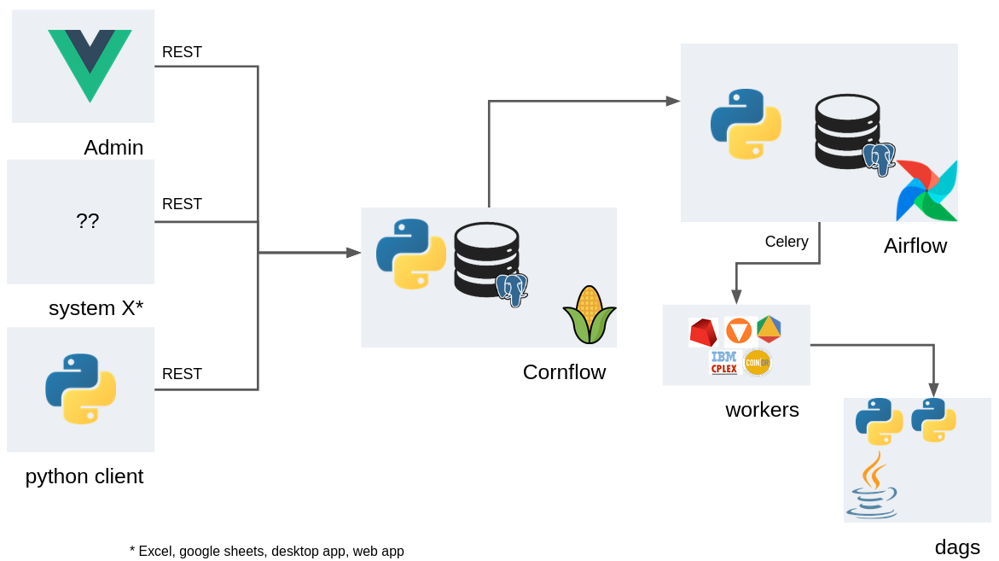

Cornflow-server architecture
=======================================

Components
-------------

.. _architecture:

   Components with the connections between them

Cornflow-server
**********************

The main component. It stores the user information, their instances, executions, etc. It is built in python+flask and is served via an REST API.

Airflow service
**********************

Apache Foundation project that is used to handle the new executions. It manages the set of workers (machines or processors) that will execute the solution methods on the instances.

Airflow has its own nomenclature, which includes some concepts we refer to in Cornflow, such as: DAGs, DAG-runs (or dagrun), workers, etc.

A DAG usually represents an Abstract Problem. A Dagrun represents an Execution.

Airflow is also built on top of flask+python. The project's site is: `airflow.apache.org/ <airflow.apache.org/>`_

Worker
************

A worker is a machine that is capable of executing an airflow task. Some of these workers will have a commercial solver license (e.g., Gurobi or CPLEX) in order to use these solvers.

Client
***********

Any library that uses the REST API to use Cornflow. There are two official clients that are currently maintained: a `SPA web app <https://github.com/baobabsoluciones/cornflow-admin>`_ and a `python package <https://github.com/baobabsoluciones/cornflow-client>`_.

The REST API is created with Open API standards (see :ref:`REST API <rest-api-reference>`), so it should be fairly easy to build new apis.

Main data flows
-----------------

.. _main-data-flows:

.. figure:: ./../_static/main_flows.png

   The main data flows between components

Create instance (data):

#. Client calls Cornflow and sends instance.
#. Cornflow asks airflow for the schema of the instance and validates the instance matches the schema.
#. Cornflow saves the instance and returns the instance code to client.

Solve instance (instance, config, dag):

#. Client calls Cornflow and gives instance code and execution configuration.
#. Cornflow asks cornflow for schema and validates the instance matches the dag to execute.
#. Cornflow calls airflow dag and assigns dagrun code to execution.
#. Cornflow creates execution and returns the execution code to client.
#. Airflow creates a rundag for the selected dag and sends it to a worker.
#. The worker asks Cornflow for the instance and the config.
#. The worker solves the problem.
#. The worker sends Cornflow the results (solution and log) of the execution.

Retrieve results (execution):

#. Client asks Cornflow for the results to an execution.
#. Cornflow returns the execution solution and / or log.

Secondary flows
----------------

.. secondary-data-flows:

.. figure:: ./../_static/secondary_flows.png

   The secondary data flows between components

Interrupt execution (execution):

#. Client asks Cornflow to stop an execution.
#. Cornflow checks the current status and asks Airflow to stop the execution.
#. Airflow kills the process and worker by deleting the execution.

Retrieve status (execution):

#. Client asks Cornflow for the results to an execution.
#. If Cornflow does not know it: it asks Airflow for the status.
#. Cornflow returns the status to the user.

Retrieve schema:

#. Client asks Cornflow for the schema to a problem.
#. Cornflow asks Airflow for the schema of a problem.
#. Airflow returns the schema if it exists.

Get instance data:

#. Client asks Cornflow for the data of an instance.
#. Cornflow returns the data of the instance if it exists.

Save manual execution:

#. Client sends Cornflow a solved problem.
#. Cornflow check the problem matches the schema.
#. Cornflow saves the execution.

