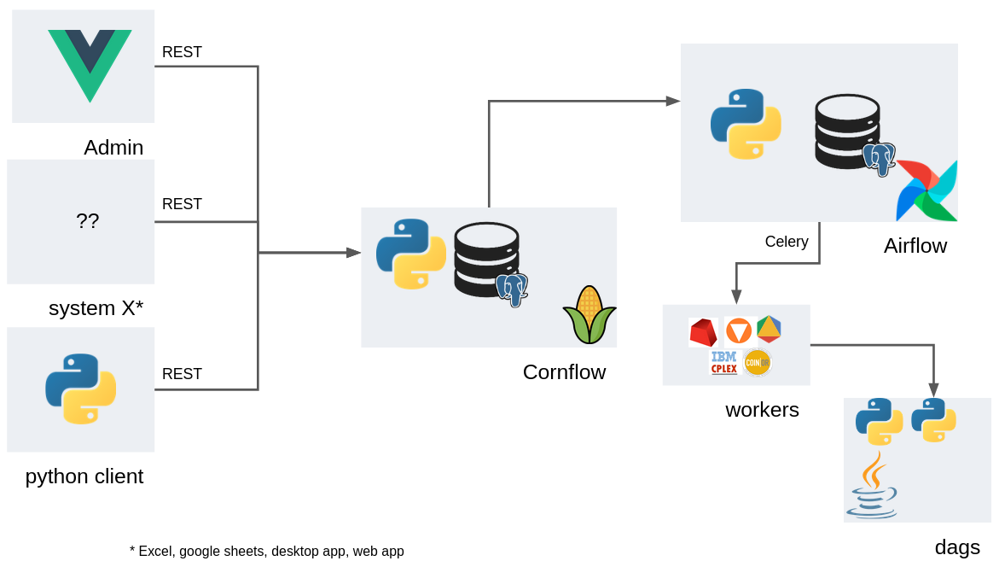

Architecture
=============

Components
-------------

Cornflow
***********

The main component. It stores the user information, their instances, executions, etc. It is built in python+flask and is used via an REST API.

Airflow
************

Apache Foundation project that is used to handle the new executions. It manages the set of workers (machines or processors) that will execute the solution methods on the instances.

Airflow has its own nomenclature, which includes some concepts we refer to in Cornflow, such as: DAGs, DAG-runs (or dagrun), workers, etc.

A DAG usually represents an Abstract Problem. A Dagrun represents an Execution.

Airflow is also built on top of flask+python. The project's site is: airflow.apache.org/

Worker
************

A worker is a machine that is capable of executing an airflow task. Some of these workers will have a commercial license (e.g., Gurobi or CPLEX) in order to use these solvers.

Client
***********

Any library that uses the REST API to use Cornflow. There are two official clients that are currently maintained: a `SPA web app <https://github.com/baobabsoluciones/cornflow-admin>`_ and a `python package <https://github.com/baobabsoluciones/cornflow-client>`_.

The REST API is created with Open API standards (see :ref:`REST API <rest-api-reference>`), so it should be fairly easy to build new apis.

Data flows
------------

.. _my-figure:

   The main data flows between components

CREATE INSTANCE (in green):

#. client calls Cornflow and sends instance.
#. Cornflow saves the instance and gives back instance code to client.

SOLVE INSTANCE (in orange):

#. client calls Cornflow and gives instance code and execution configuration.
#. Cornflow creates execution, calls airflow dag and sends execution code.
#. Cornflow, returns code to the user.
#. Airflow executes a dag (creates a rundag for the instance) and sends it to a worker.
#. the dagrun asks the data from Cornflow for the instance and the config for that execution.
#. the dagrun solves the problem.
#. the dagrun sends Cornflow the results of the execution.

RETRIEVE INSTANCE (in purple):

#. The client can check the status of the execution via Cornflow.
#. Cornflow asks Airflow for status and returns it to the user.
#. The client can download the results when the execution finishes.
