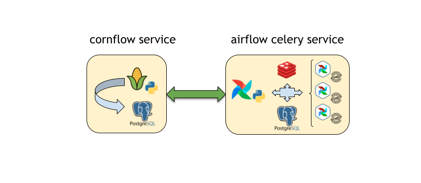

Running with simultaneous resolutions
--------------------------------------------------

To do this kind of deployment, you could use the template ``docker-compose-cornflow-celery.yml``.
To deploy you should fetch ``docker-compose-cornflow-celery.yml``::

    curl -LfO 'https://raw.githubusercontent.com/baobabsoluciones/corn/master/docker-compose-cornflow-celery.yml'

Airflow service allows you to run with ``CeleryExecutor``. For more information, see `Basic airflow architecture <https://airflow.apache.org/docs/apache-airflow/stable/concepts.html>`_.

This type of deployment allows simultaneous execution of resolution jobs. For this, different machines are created with an airflow installation that communicate with the main server through a message broker. These machines are defined as ``workers``.
You can deploy as many workers as you want, but taking into account that each parallel execution will consume hardware host resources.

.. _cornflow_celery_docker_stack:

    Demonstration of the cornflow service with three instances of simultaneous execution communicating through redis.

If you are running cornflow with multiple workers, there are additional resources that must be provided in your deployment:

#. airflow worker machines
#. airflow flower server
#. redis message broker server

New environment variables must also be taken into account for services running in Celery mode::

    EXECUTOR - Airflow execution mode. In this case the value it should have is Celery.
    AIRFLOW__CORE__FERNET_KEY - A fernet key is used to encrypt and decrypt tokens managed by aiflow. All airflow related services must have the same key value.
    AIRFLOW__CELERY__BROKER_URL - CeleryExecutor drives the need for a Celery broker, here Redis is used.

For running with CeleryExecutor execute this command::

    docker-compose -f docker-compose-cornflow-celery.yml up -d

    CONTAINER ID   IMAGE                             COMMAND                  CREATED         STATUS                   PORTS                                                           NAMES
    e13c87bcd36b   baobabsoluciones/docker-airflow   "/initairflow.sh wor…"   6 minutes ago   Up 6 minutes             5555/tcp, 8080/tcp, 8793/tcp                                    corn_worker_1
    5a96cc04b69b   baobabsoluciones/docker-airflow   "/initairflow.sh sch…"   6 minutes ago   Up 5 minutes             5555/tcp, 8080/tcp, 8793/tcp                                    corn_scheduler_1
    c5d3fdad4c6b   baobabsoluciones/cornflow         "./initapp.sh"           6 minutes ago   Up 6 minutes             0.0.0.0:5000->5000/tcp, :::5000->5000/tcp                       corn_cornflow_1
    e98dfc643ddd   baobabsoluciones/docker-airflow   "/initairflow.sh web…"   6 minutes ago   Up 6 minutes (healthy)   5555/tcp, 8793/tcp, 0.0.0.0:8080->8080/tcp, :::8080->8080/tcp   corn_webserver_1
    129fd9b29361   baobabsoluciones/docker-airflow   "/initairflow.sh flo…"   6 minutes ago   Up 6 minutes             8080/tcp, 0.0.0.0:5555->5555/tcp, :::5555->5555/tcp, 8793/tcp   corn_flower_1
    c56e3444078c   postgres                          "docker-entrypoint.s…"   6 minutes ago   Up 6 minutes             5432/tcp                                                        corn_airflow_db_1
    7a7b10d09a46   redis:5.0.5                       "docker-entrypoint.s…"   6 minutes ago   Up 6 minutes             6379/tcp                                                        corn_redis_1
    8389735999d5   postgres                          "docker-entrypoint.s…"   6 minutes ago   Up 6 minutes             5432/tcp                                                        corn_cornflow_db_1

The number of ``workers`` deployed depends on ``--scale`` argument. For example, if number of workers needed is 3::

    docker-compose -f docker-compose-cornflow-celery.yml up -d --scale worker=3

    CONTAINER ID   IMAGE                             COMMAND                  CREATED         STATUS                   PORTS                                                           NAMES
    65de0e382a04   baobabsoluciones/docker-airflow   "/initairflow.sh wor…"   4 minutes ago   Up 53 seconds            5555/tcp, 8080/tcp, 8793/tcp                                    corn_worker_1
    4c872f5b6647   baobabsoluciones/docker-airflow   "/initairflow.sh wor…"   4 minutes ago   Up 4 minutes             5555/tcp, 8080/tcp, 8793/tcp                                    corn_worker_3
    fca4c231139f   baobabsoluciones/docker-airflow   "/initairflow.sh wor…"   4 minutes ago   Up 54 seconds            5555/tcp, 8080/tcp, 8793/tcp                                    corn_worker_2
    a7f2868e9329   baobabsoluciones/docker-airflow   "/initairflow.sh sch…"   4 minutes ago   Up 24 seconds            5555/tcp, 8080/tcp, 8793/tcp                                    corn_scheduler_1
    f21b97ae83e8   baobabsoluciones/cornflow         "./initapp.sh"           4 minutes ago   Up 4 minutes             0.0.0.0:5000->5000/tcp, :::5000->5000/tcp                       corn_cornflow_1
    68d8f7db53ac   baobabsoluciones/docker-airflow   "/initairflow.sh web…"   4 minutes ago   Up 4 minutes (healthy)   5555/tcp, 8793/tcp, 0.0.0.0:8080->8080/tcp, :::8080->8080/tcp   corn_webserver_1
    7d6e114978af   baobabsoluciones/docker-airflow   "/initairflow.sh flo…"   4 minutes ago   Up 3 minutes             8080/tcp, 0.0.0.0:5555->5555/tcp, :::5555->5555/tcp, 8793/tcp   corn_flower_1
    d2730ce4b8c1   postgres                          "docker-entrypoint.s…"   4 minutes ago   Up 4 minutes             5432/tcp                                                        corn_cornflow_db_1
    ec86c6761b80   postgres                          "docker-entrypoint.s…"   4 minutes ago   Up 4 minutes             5432/tcp                                                        corn_airflow_db_1
    2d5200460cfb   redis:5.0.5                       "docker-entrypoint.s…"   4 minutes ago   Up 4 minutes             6379/tcp                                                        corn_redis_1

Airflow service available at http://localhost:8080
Flower service available at http://localhost:5555

If you want to stop the docker services and remove all volumes::

    docker-compose down -f docker-compose-cornflow-celery.yml --volumes --rmi all
