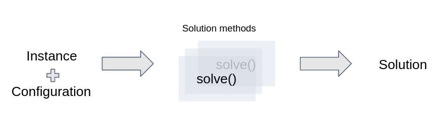
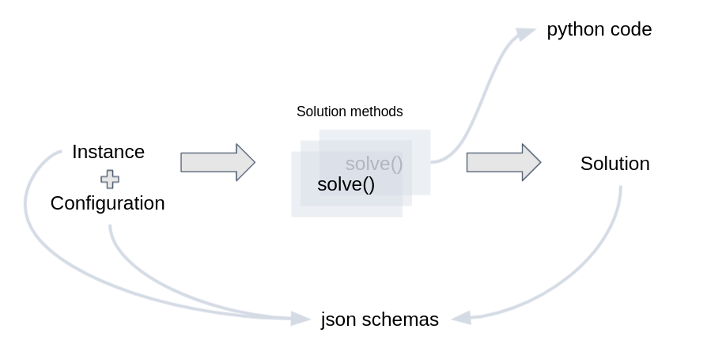
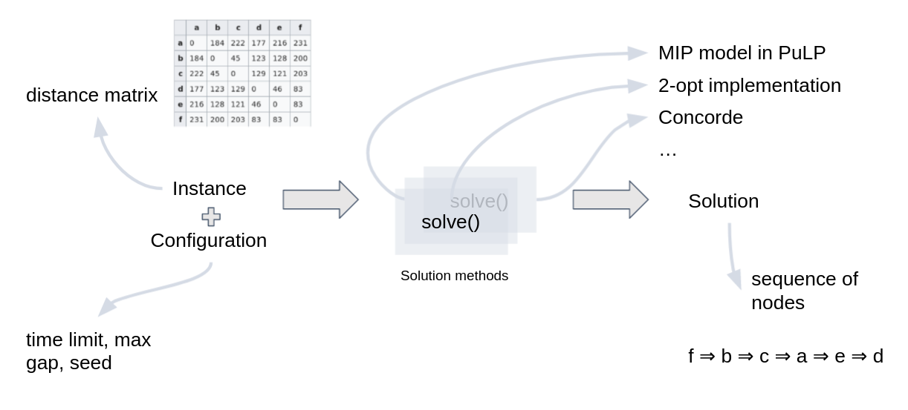
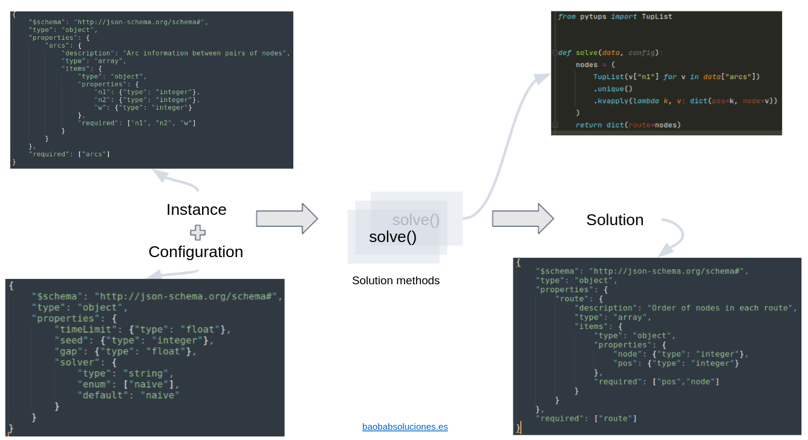

Concepts
==========================

Decision (Optimization) problem
----------------------------------

A quote from the first paragraph of the `Wikipedia article on Decision problem <https://en.wikipedia.org/wiki/Decision_problem>`_:

    In computability theory and computational complexity theory, a decision problem is a problem that can be posed as a yes-no question of the input values. An example of a decision problem is deciding whether a given natural number is prime. Another is the problem "given two numbers x and y, does x evenly divide y?". The answer is either 'yes' or 'no' depending upon the values of x and y. A method for solving a decision problem, given in the form of an algorithm, is called a decision procedure for that problem. A decision procedure for the decision problem "given two numbers x and y, does x evenly divide y?" would give the steps for determining whether x evenly divides y. One such algorithm is long division. If the remainder is zero the answer is 'yes', otherwise it is 'no'. A decision problem which can be solved by an algorithm is called decidable. 

In this guide, we do not make a clear difference between Decision problem and Optimization problem. In both cases we care on finding a solution (or the best solution) given a feasible solution space.

We sometimes refer to this Decision Problem as an Abstract Problem or just Problem. Some Problems are quite famous, such as the  `Traveling Salesman Problem <https://en.wikipedia.org/wiki/Travelling_salesman_problem>`_ and the `Knapsack Problem <https://en.wikipedia.org/wiki/Knapsack_problem>`_. Naming a Problem makes it possible to design Solution Methods that are tailored for that particular Problem.

In Cornflow, a Problem is represented by two schema json files: the first schema file describes the kind of input data format it accepts. This schema describes any Instance of the Problem. The second schema file describes the output data format it returns. This schema describes any Solution of the Problem.

.. _concepts1:

   Main concepts in a Cornflow deployment of an Optimization Problem

Instance
-------------

An Instance represents all the data needed to completely formulate one case of a decision problem.

In Cornflow, it is represented as a `data` json file. This file should be sufficient to represent the Feasible Solution Space and provide enough information to determine if one Solution to the problem is better or worse than another. We sometimes call it "input data". It needs to follow the input data schema.

Feasible Solution Space
-----------------------------

Is the set of all Solutions that are valid given an Instance of a Problem. In most problems this set is never calculated since it is too big to calculate or store.

Solution
-----------

A Solution represents all data needed to completely represent a feasible solution to an Instance. 

In Cornflow, it is represented as a `data` json file. This file should be sufficient to, when used together with an Instance, determine if the solution is feasible and the Objective Function Value of the Solution. We sometimes call it "Output Data". It needs to follow the output data schema.

Experiment
-------------

This is just a convenient way to tie an Instance and a Solution together to be able to validate and compare solutions. It represents a "solved Instance".

Solution Method
-------------------

A solution method (also called Algorithm) is a function that takes as input an Instance and returns a Solution. The Solution Method can be exact (i.e., it proves it can find the best solution) or inexact (i.e., there is no proof).

In Cornflow, A Solution Method is a subclass of Experiment.

Configuration
---------------------

Each Solution Method has ways to configure certain characteristics. The solve Configuration stores that personalization, such as the time limit, the gap tolerance, among other.

Execution
-------------

Consists of: (1) an Instance with (2) a Solve Configuration and (3) a Solution Method. It is the actual solving of the Decision Problem. It returns a Solution.

Implementation
-------------------

In practice, Cornflow uses jsonschema to validate the schemas of Instance, Configuration and Solution. It uses python to define a solve method.

.. _concepts2:

   Implementation of main concepts

An example with TSP
------------------------

Let's take the classical (and famous) problem of the TSP. We need to find the shortest path that joins all nodes in a graph and passes only once through each node. The input data is the distance matrix between each pair of nodes. The output data is an ordered list of nodes (to visit).

Solution methods can be many: a MIP model, a CP model, a call to the `Concorde solver <https://www.math.uwaterloo.ca/tsp/concorde.html>`_, a 2-opt heuristic implementation among many others.

.. _concepts_tsp:

   Implementation of concepts for a TSP

The following figure shows the schemas and python code required to build the smallest possible TSP Optimization Problem. The solve method consists of returning the nodes in an arbitrary order. Although the solution complies with the schema, the quality of this solution will probable be very low.

.. _concepts_tsp2:

   Schemas and solve method for TSP implementation

For more details on these schemas, check :ref:`the json-schema section<Write a json-schema>`. That section includes also the complete :ref:`TSP schemas in text form<Example with TSP>`.

