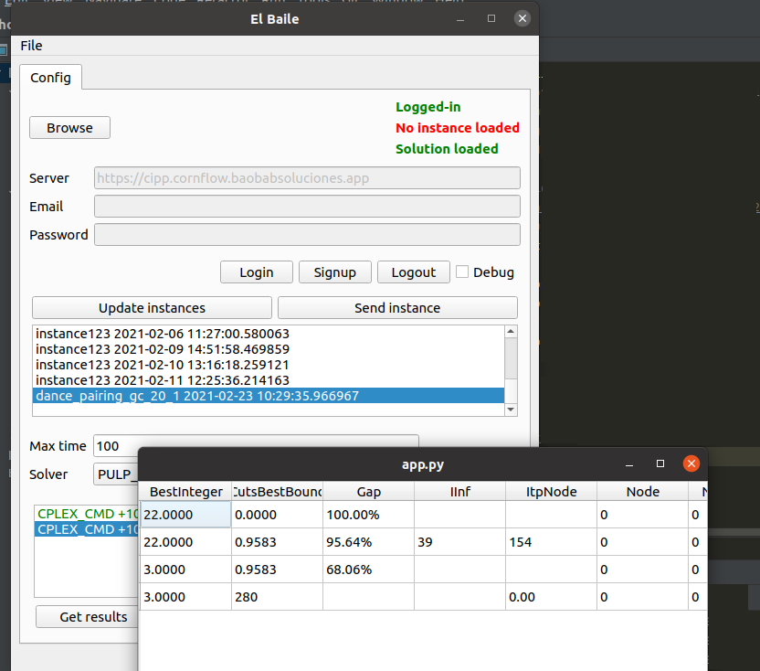
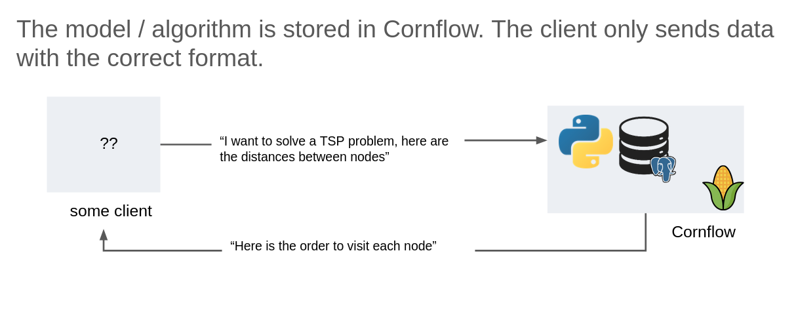

Examples
=========

The `examples repository <https://github.com/baobabsoluciones/cornflow-examples>`_ includes several projects using cornflow from:

#. a command line app.
#. a desktop app.
#. a web app.

All are built in python and make use of the :ref:`Python API <python-api>`.

.. _gui:

   Example desktop app showing a log for a solution

Use case 1
------------

The first use case is to use Cornflow as a repository of several **generic** solvers. For example: cplex, gurobi, cpo, mosek, or-tools, localsolver, etc.

Here, the client is in charge to formulate the model (in a standard way: a json) and then send it to the server, as well as the solver to solve it with.

.. _use_case1:

   Use case 1: Cornflow as a generic remote solver repository

Use case 2
------------

The second use case is to use Cornflow as a repository of several **specific** solvers with one very well-specified problem as objective. For example: a solver to solve TSP problems, graph-coloring problems, or any other problem.

Here, the client is in charge to send the the server an instance dataset with the appropiate format (schema) that matches the solver to use.

.. _use_case2:

   Use case 1: Cornflow as an application remote solver repository
